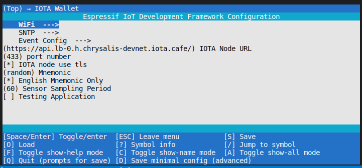
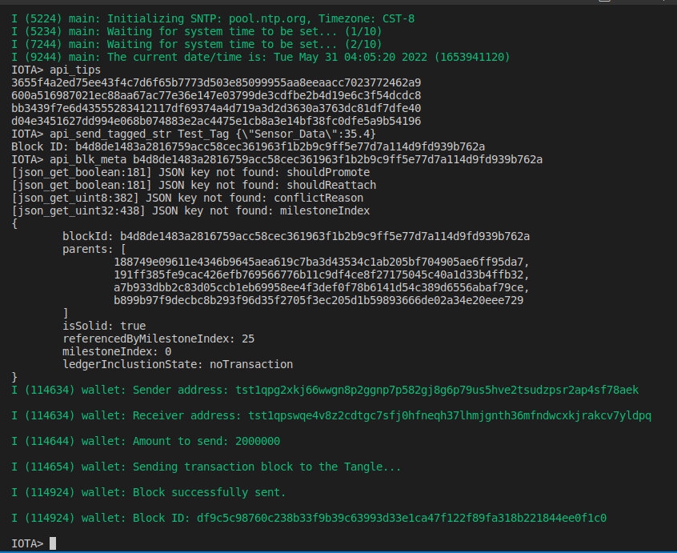
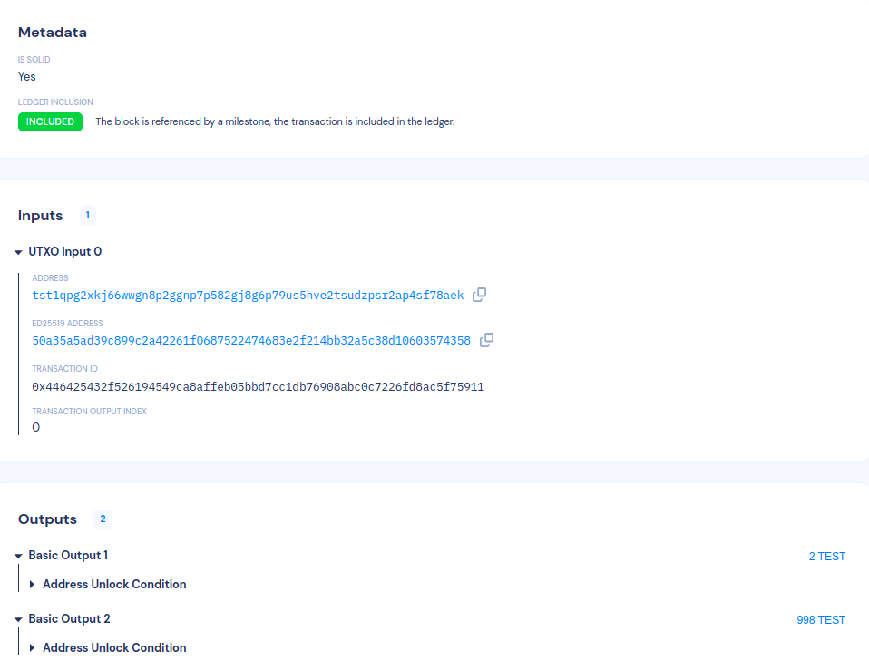
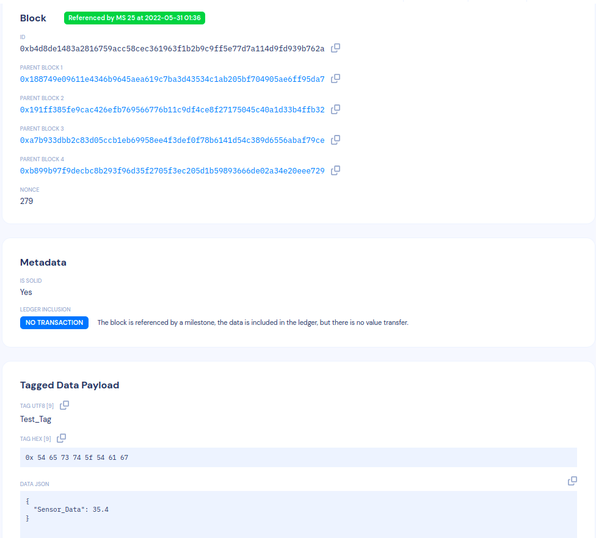

# IOTA Client Software Development Kit(SDK) for ESP32

This SDK is built on top of [iota.c](https://github.com/iotaledger/iota.c) and [ESP-IDF](https://github.com/espressif/esp-idf) for IOTA client development on ESP32 MCU series.

Learn more about [iota.c](https://github.com/iotaledger/iota.c) please visit [IOTA C Client Documentation](https://iota-c-client.readthedocs.io/en/latest/index.html)

## Example Commands

This SDK provides some example for testing and learn IOTA Client application, commands are shown below:

**Client API**

- `node_info` - Get info from the connected node
- `api_tips` - Get tips from the connected node
- `api_get_blk <Block Id>` - Get a block from a given block ID
- `api_blk_meta <Block Id>` - Get metadata from a given block ID
- `api_blk_children <Block Id>` - Get children from a given block ID
- `api_get_output <Output Id>` - Get the output object from a given output ID
- `api_send_tagged_str <Tag> <Data>` - Send out tagged data string to the Tangle

**Wallet**

- `wallet_get_balance <bech32 address>` - Get balance from a given bech32 address
- `wallet_send_token <sender index> <receiver index> <amount>` - Send tokens from sender address to receiver address

**System**

- `help` - List commands
- `free` - Get the size of available heap.
- `heap` - Get heap info
- `stack` - Get main stack info
- `version` - Get esp32 and wallet versions
- `restart` - system reboot

**Node Events**

The node event API is in charge of publishing information about events within the node software.
- Event Config : `menuconfig->IOTA Wallet->Event Config`
- Command : `node_events`
- Argument : `<event_select>`
- Usage : `node_events <event_select>`

*Note :*
- *The paramter <event_select> should be a one byte hexadecimal value of range 0 - FF.* Eg: `node_events 2F`
- *To stop receiving events, <event_select> should be 0 :* `node_events 0`
- *The set bit positions of the <event_select> hexadecimal value determines the events to be subscribed. Refer the table below for events, bit positions and its config parameters.*

| Event | Bit Position | Menu Config |
|:---:|:---:|:---:|
| milestones/latest | 1 | * |
| milestones/confirmed | 1 | * |
| blocks | 2 | * |
| blocks/tagged-data | 3 | * |
| milestones | 4 | * |
| block-metadata/[block Id] | 5 | Block Id |
| outputs/[outputId] | 6 | Output Id |
| transactions/[transactionId]/included-block | 7 | Transaction Id |
| blocks/transaction | 8 | * |

*Position of bit to be counted from the LSB side.*

## Requirements

This project was tested on `ESP32-DevKitC V4` and `ESP32-C3-DevKitC 02` dev boards.

- [ESP32-DevKitC V4](https://docs.espressif.com/projects/esp-idf/en/latest/esp32/hw-reference/modules-and-boards.html#esp32-devkitc-v4)
- [ESP32-C3-DevKitC-02](https://docs.espressif.com/projects/esp-idf/en/latest/esp32c3/hw-reference/esp32c3/user-guide-devkitc-02.html#esp32-c3-devkitc-02)

## Build system setup

Please follow documentations to setup your toolchain and development framework.

- [esp32 get started](https://docs.espressif.com/projects/esp-idf/en/latest/esp32/get-started/index.html)
- [esp32-c3 get started](https://docs.espressif.com/projects/esp-idf/en/latest/esp32c3/get-started/index.html)

**Notice: This SDK is tested under [esp-idf/release/v4.3](https://github.com/espressif/esp-idf/tree/release/v4.3)**

Clone esp-idf from GitHub

```
$ git clone --recursive https://github.com/espressif/esp-idf.git
$ cd esp-idf
$ git submodule update --init --recursive
$ ./install.sh
$ source ./export.sh
```

### Build Wallet Application

Clone the wallet source code

```
git clone https://github.com/iotaledger/esp32-client-sdk.git
cd esp32-client-sdk
git submodule update --init --recursive
```

Here we need to set the target device before configuration.

For ESP32

```
$ idf.py set-target esp32
```

For ESP32-C3

```
$ idf.py set-target esp32c3
```

By default, the wallet uses a `random` mnemonic, you can set the mnomonic in `(random) Mnemonic` by **menuconfig**

```
$ idf.py menuconfig
```


*Update IOTA node endpoint*
```
IOTA Wallet  --->
      WiFi  --->
      SNTP  --->
      Event Config  --->
  (https://api.lb-0.h.chrysalis-devnet.iota.cafe/) IOTA Node URL
  (443) IOTA node port number
  [ ] IOTA node use tls
  (random) Mnemonic
  [*] English Mnemonic Only
  (60) Sensor Sampling Period
  [ ] Testing Application
```
*Configure Wifi Username and Password so ESP32 can connect in Station Mode, make sure WiFi endpoint has internet access*
```
IOTA Wallet --> WiFi --->
  (myssid) WiFi SSID
  (mypass) WiFi Password
  (5) Maximum Retry
```
*Update config for Node Events*
```
IOTA Wallet --> Event Config --->
  (mqtt.lb-0.h.chrysalis-devnet.iota.cafe) Events Node URL
  (1883) Events Port
  (iota_test_@123) Events Client Id
  () Block Id : Will be used for block-metadata/[block Id] event
  () Output Id : Will be used for outputs/[outputId] event
  () Transaction Id : Will be used for transactions/[transactionId]/included-block event

$ idf.py build

$ idf.py -p [PORT] flash monitor
```

### Run the Example Application

#### Cli Examples


#### Transaction Message


#### Data Message


**Notice: these messages are on the `testnet` that might not be found after a network reset.**

## Troubleshooting

`E (38) boot_comm: This chip is revision 2 but the application is configured for minimum revision 3. Can't run.`

I'm using ESP32-C3 Rev2 but the current ESP-IDF uses Rev 3 as default, we need to change it via `idf.py menuconfig`

```
Component config ---> ESP32C3-Specific ---> Minimum Supported ESP32-C3 Revision (Rev 3)  ---> Rev 2
```
